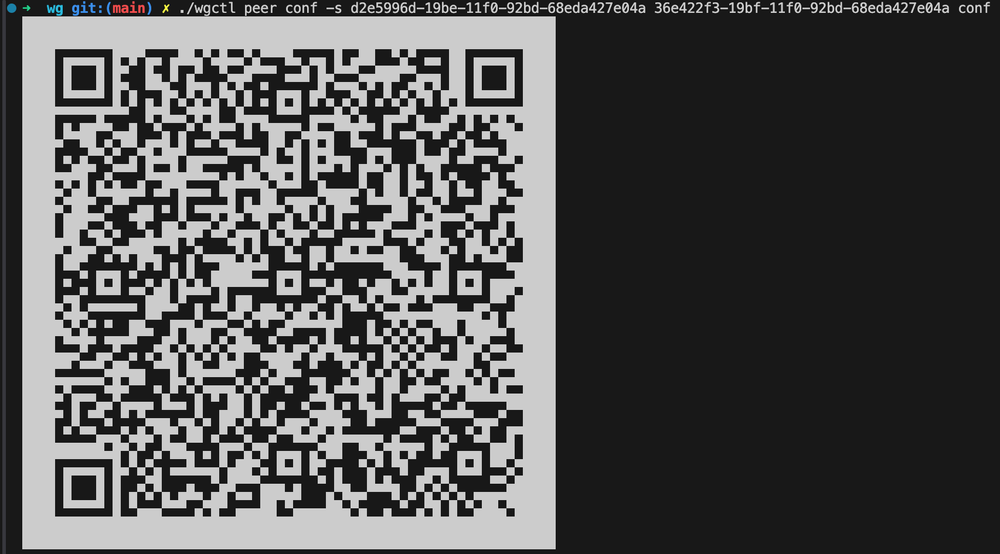

VPN server base on wireguard
============================

Components
----------
* apiserver: offered api to create or list subnet and peers of subnet, list on 5443
* wgctl: a tool to list vpn reources like subnet and peer, support get vpn config qrcode for peer

How to
------
**Server**
Run and exit
```
➜  wg git:(main) ./apiserver -d ./conf -v 4
I0415 14:22:10.123307  227926 apiserver.go:100] Setup subnet: default uuid: d2e5996d-19be-11f0-92bd-68eda427e04a iface: wg0
I0415 14:22:10.214474  227926 apiserver.go:132] Sync wireguard finished
I0415 14:22:10.215588  227926 apiserver.go:297] Start listen on port 5443 ...
...
^CI0415 14:22:16.921567  227926 apiserver.go:302] Term signal received, teardown wireguard server, please wait ...
I0415 14:22:16.922258  227926 apiserver.go:161] Teardown subnet: default uuid: d2e5996d-19be-11f0-92bd-68eda427e04a iface: wg0
I0415 14:22:17.062236  227926 apiserver.go:304] Teardwon finished, ctrl+c to exist
^C#
```
When run apisever will create wireguard interfaces and set peers base on db data.
When exit, it will handle the signal do teardown to delete wireguard interfaces.

**Wgctl**

Create subnet
```
➜  wg git:(main) ✗ ./wgctl subnet list                      
UUID  Name  Address  Public Key  
➜  wg git:(main) ✗ ./wgctl subnet add -f dist/subnet.yaml
{
 "addr": "10.66.0.1/24",
 "iface": "wg0",
 "name": "default",
 "port": "51820",
 "uuid": "d2e5996d-19be-11f0-92bd-68eda427e04a"
}
➜  wg git:(main) ✗ ./wgctl subnet list                   
UUID                                  Name     Address       Public Key                                    
d2e5996d-19be-11f0-92bd-68eda427e04a  default  10.66.0.1/24  aiA0hfOtAyQK0fj6Pkt5j1dhrjiNU1nwqmTNW98IXzc=
```

Create peer
```
➜  wg git:(main) ✗ ./wgctl peer list -s d2e5996d-19be-11f0-92bd-68eda427e04a                 
UUID  User  Address  Public Key  Enable  
➜  wg git:(main) ✗ ./wgctl peer add -f dist/peer.yaml
{
 "addr": "10.66.0.2/24",
 "name": "lucheng",
 "subnet": "d2e5996d-19be-11f0-92bd-68eda427e04a",
 "uuid": "36e422f3-19bf-11f0-92bd-68eda427e04a"
}
➜  wg git:(main) ✗ ./wgctl peer list -s d2e5996d-19be-11f0-92bd-68eda427e04a
UUID                                  User     Address       Public Key                                    Enable  
36e422f3-19bf-11f0-92bd-68eda427e04a  lucheng  10.66.0.2/24  hi37FXbt/vhfm2P07MmWqff7MSdCVe1Yu+Ro+mCjfyM=  true
➜  wg git:(main) wg  
interface: wg0
  public key: aiA0hfOtAyQK0fj6Pkt5j1dhrjiNU1nwqmTNW98IXzc=
  private key: (hidden)
  listening port: 51820

peer: hi37FXbt/vhfm2P07MmWqff7MSdCVe1Yu+Ro+mCjfyM=
  allowed ips: 10.66.0.2/32
```

Set peer disable and enable
```
➜  wg git:(main) ✗ ./wgctl peer set -s d2e5996d-19be-11f0-92bd-68eda427e04a 36e422f3-19bf-11f0-92bd-68eda427e04a disable
true
➜  wg git:(main) ✗ ./wgctl peer list -s d2e5996d-19be-11f0-92bd-68eda427e04a                                            
UUID                                  User     Address       Public Key                                    Enable  
36e422f3-19bf-11f0-92bd-68eda427e04a  lucheng  10.66.0.2/24  hi37FXbt/vhfm2P07MmWqff7MSdCVe1Yu+Ro+mCjfyM=  false   
➜  wg git:(main) ✗ wg
interface: wg0
  public key: aiA0hfOtAyQK0fj6Pkt5j1dhrjiNU1nwqmTNW98IXzc=
  private key: (hidden)
  listening port: 51820
➜  wg git:(main) ✗ ./wgctl peer set -s d2e5996d-19be-11f0-92bd-68eda427e04a 36e422f3-19bf-11f0-92bd-68eda427e04a enable 
true
➜  wg git:(main) ✗ ./wgctl peer list -s d2e5996d-19be-11f0-92bd-68eda427e04a                                           
UUID                                  User     Address       Public Key                                    Enable  
36e422f3-19bf-11f0-92bd-68eda427e04a  lucheng  10.66.0.2/24  hi37FXbt/vhfm2P07MmWqff7MSdCVe1Yu+Ro+mCjfyM=  true    
➜  wg git:(main) ✗ wg                                                                                                  
interface: wg0
  public key: aiA0hfOtAyQK0fj6Pkt5j1dhrjiNU1nwqmTNW98IXzc=
  private key: (hidden)
  listening port: 51820

peer: hi37FXbt/vhfm2P07MmWqff7MSdCVe1Yu+Ro+mCjfyM=
  allowed ips: 10.66.0.2/32
```

Get peer config

