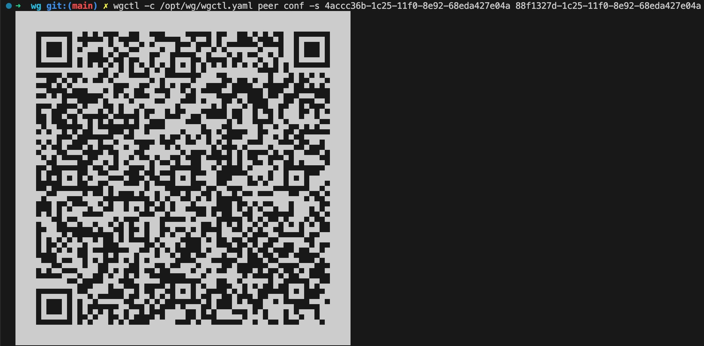
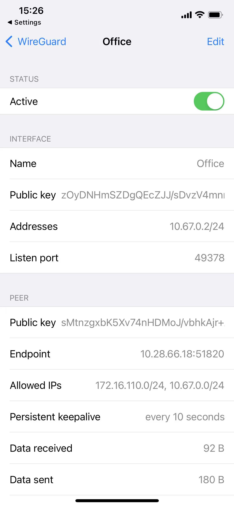
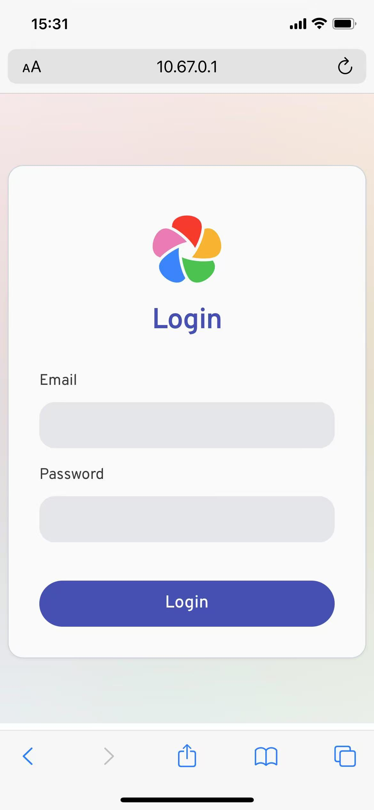

VPN server base on wireguard
============================

Components
----------
* apiserver: offered api to create or list subnet and peers of subnet, list on 5443
* wgctl: a tool to list vpn reources like subnet and peer, support get vpn config qrcode for peer

How to
------
**Server**
Run and exit
```
➜  wg git:(main) ./apiserver -d ./conf -v 4
I0415 14:22:10.123307  227926 apiserver.go:100] Setup subnet: default uuid: d2e5996d-19be-11f0-92bd-68eda427e04a iface: wg0
I0415 14:22:10.214474  227926 apiserver.go:132] Sync wireguard finished
I0415 14:22:10.215588  227926 apiserver.go:297] Start listen on port 5443 ...
...
^CI0415 14:22:16.921567  227926 apiserver.go:302] Term signal received, teardown wireguard server, please wait ...
I0415 14:22:16.922258  227926 apiserver.go:161] Teardown subnet: default uuid: d2e5996d-19be-11f0-92bd-68eda427e04a iface: wg0
I0415 14:22:17.062236  227926 apiserver.go:304] Teardwon finished, ctrl+c to exist
^C#
```
When run apisever will create wireguard interfaces and set peers base on db data.
When exit, it will handle the signal do teardown to delete wireguard interfaces.

**Wgctl**

Create subnet
```
➜  wg git:(main) ✗ wgctl -c /opt/wg/wgctl.yaml subnet add -f dist/subnet.yaml                 
{
 "addr": "10.67.0.1/24",
 "iface": "wg0",
 "name": "default",
 "port": "51820",
 "uuid": "4accc36b-1c25-11f0-8e92-68eda427e04a"
}
➜  wg git:(main) ✗ wgctl -c /opt/wg/wgctl.yaml subnet list
UUID                                  Name     Address       Public Key                                    
4accc36b-1c25-11f0-8e92-68eda427e04a  default  10.67.0.1/24  sMtnzgxbK5Xv74nHDMoJ/vbhkAjr+AZ92BWJwWbOVjo=  
➜  wg git:(main) ✗ wg
interface: wg0
  public key: sMtnzgxbK5Xv74nHDMoJ/vbhkAjr+AZ92BWJwWbOVjo=
  private key: (hidden)
  listening port: 51820
```

Create peer
```
➜  wg git:(main) ✗ wgctl -c /opt/wg/wgctl.yaml peer add -f dist/peer.yaml 
{
 "addr": "10.67.0.2/24",
 "name": "lucheng",
 "subnet": "4accc36b-1c25-11f0-8e92-68eda427e04a",
 "uuid": "88f1327d-1c25-11f0-8e92-68eda427e04a"
}
➜  wg git:(main) ✗ wgctl -c /opt/wg/wgctl.yaml peer list -s 4accc36b-1c25-11f0-8e92-68eda427e04a
UUID                                  User     Address       Public Key                                    Enable  
88f1327d-1c25-11f0-8e92-68eda427e04a  lucheng  10.67.0.2/24  zOyDNHmSZDgQEcZJJ/sDvzV4mnm1CvetZDnhM206xhc=  true    
➜  wg git:(main) ✗ wg                                                                           
interface: wg0
  public key: sMtnzgxbK5Xv74nHDMoJ/vbhkAjr+AZ92BWJwWbOVjo=
  private key: (hidden)
  listening port: 51820

peer: zOyDNHmSZDgQEcZJJ/sDvzV4mnm1CvetZDnhM206xhc=
  allowed ips: 10.67.0.2/32
```

Set peer disable and enable
```
➜  wg git:(main) ✗ wgctl -c /opt/wg/wgctl.yaml peer set -s 4accc36b-1c25-11f0-8e92-68eda427e04a 88f1327d-1c25-11f0-8e92-68eda427e04a disable 
true
➜  wg git:(main) ✗ wgctl -c /opt/wg/wgctl.yaml peer list -s 4accc36b-1c25-11f0-8e92-68eda427e04a                                            
UUID                                  User     Address       Public Key                                    Enable  
88f1327d-1c25-11f0-8e92-68eda427e04a  lucheng  10.67.0.2/24  zOyDNHmSZDgQEcZJJ/sDvzV4mnm1CvetZDnhM206xhc=  false   
➜  wg git:(main) ✗ wg
interface: wg0
  public key: sMtnzgxbK5Xv74nHDMoJ/vbhkAjr+AZ92BWJwWbOVjo=
  private key: (hidden)
  listening port: 51820
➜  wg git:(main) ✗ wgctl -c /opt/wg/wgctl.yaml peer set -s 4accc36b-1c25-11f0-8e92-68eda427e04a 88f1327d-1c25-11f0-8e92-68eda427e04a enable 
true
➜  wg git:(main) ✗ wgctl -c /opt/wg/wgctl.yaml peer list -s 4accc36b-1c25-11f0-8e92-68eda427e04a                                           
UUID                                  User     Address       Public Key                                    Enable  
88f1327d-1c25-11f0-8e92-68eda427e04a  lucheng  10.67.0.2/24  zOyDNHmSZDgQEcZJJ/sDvzV4mnm1CvetZDnhM206xhc=  true    
➜  wg git:(main) ✗ wg
interface: wg0
  public key: sMtnzgxbK5Xv74nHDMoJ/vbhkAjr+AZ92BWJwWbOVjo=
  private key: (hidden)
  listening port: 51820

peer: zOyDNHmSZDgQEcZJJ/sDvzV4mnm1CvetZDnhM206xhc=
  allowed ips: 10.67.0.2/32
```

Get peer config



Connect to server with wireguard app
```
➜  wg git:(main) ✗ wg                 
interface: wg0
  public key: sMtnzgxbK5Xv74nHDMoJ/vbhkAjr+AZ92BWJwWbOVjo=
  private key: (hidden)
  listening port: 51820

peer: zOyDNHmSZDgQEcZJJ/sDvzV4mnm1CvetZDnhM206xhc=
  endpoint: 10.28.66.26:49378
  allowed ips: 10.67.0.2/32
  latest handshake: 1 minute, 7 seconds ago
  transfer: 404 B received, 220 B sent
➜  wg git:(main) ✗ ping -c 1 10.67.0.2
PING 10.67.0.2 (10.67.0.2) 56(84) bytes of data.
64 bytes from 10.67.0.2: icmp_seq=1 ttl=64 time=837 ms

--- 10.67.0.2 ping statistics ---
1 packets transmitted, 1 received, 0% packet loss, time 0ms
rtt min/avg/max/mdev = 836.714/836.714/836.714/0.000 ms
```

Test


